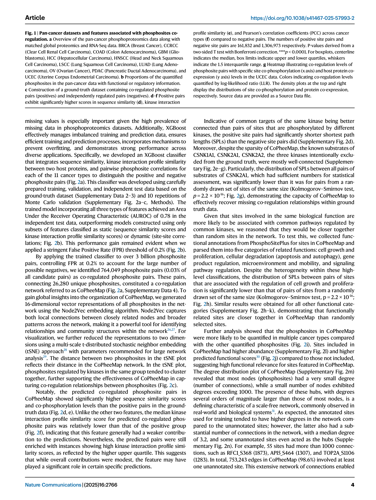
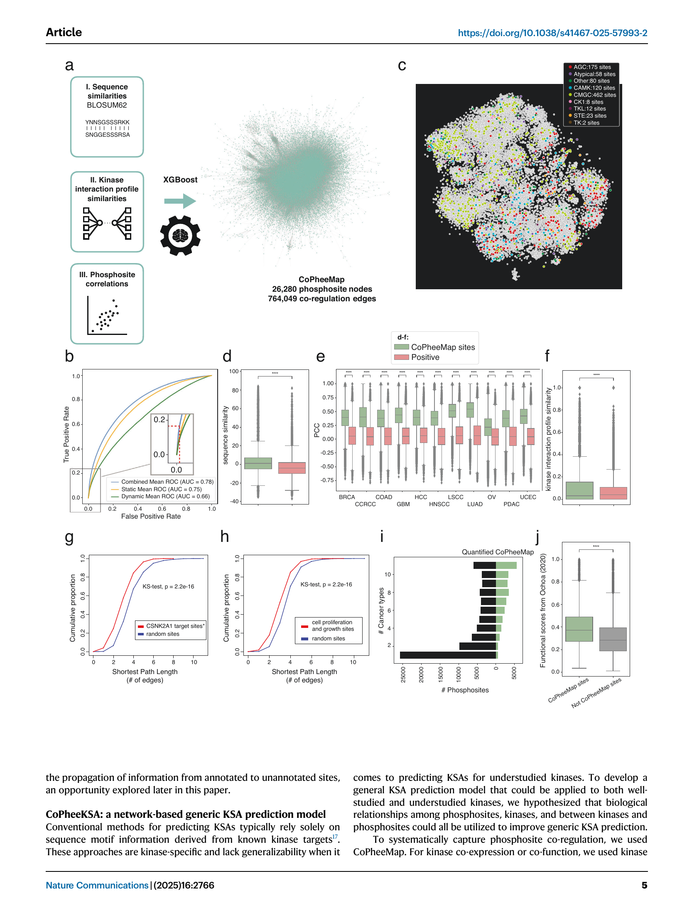
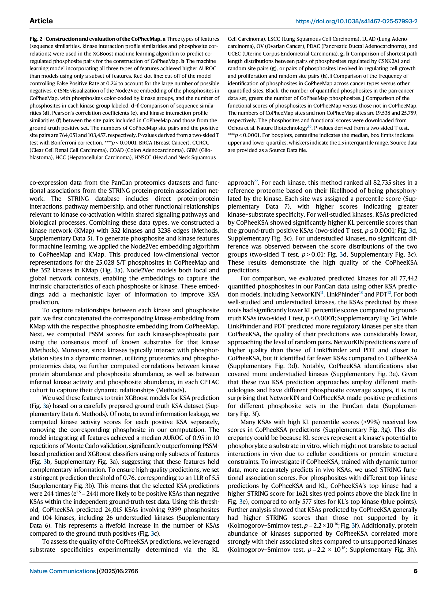
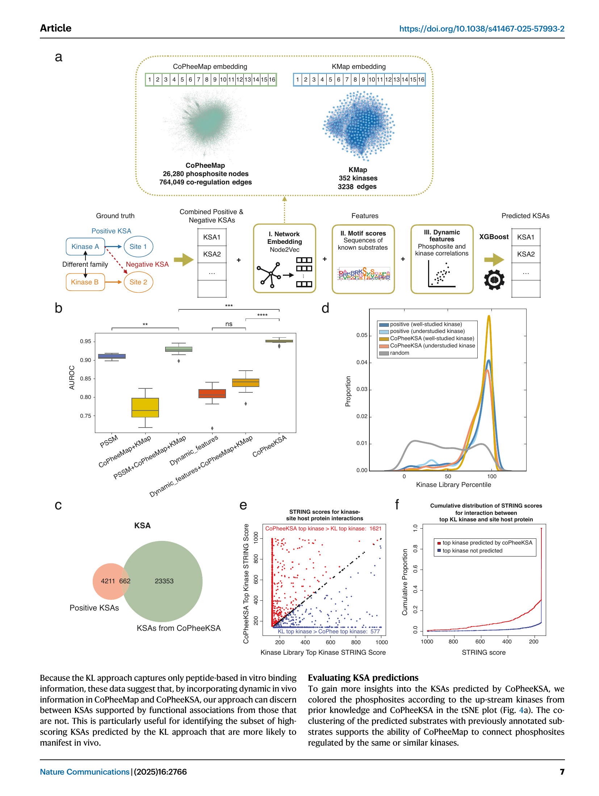
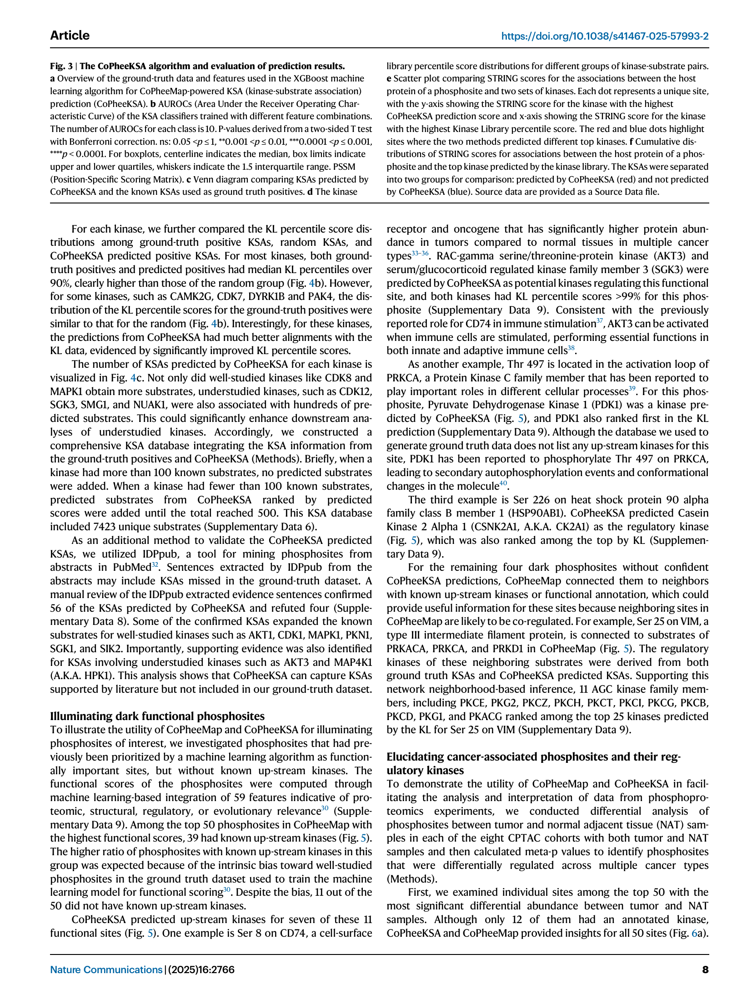
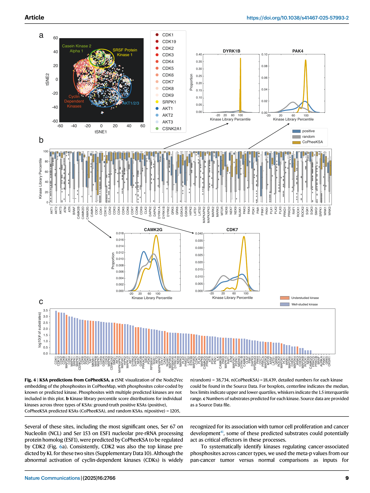
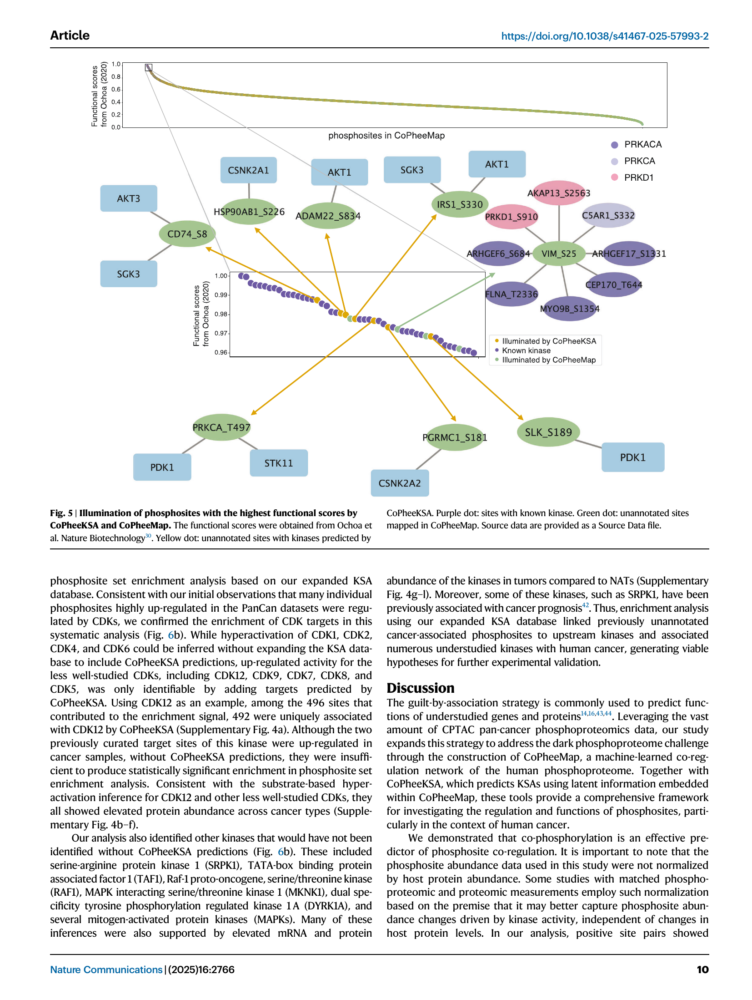
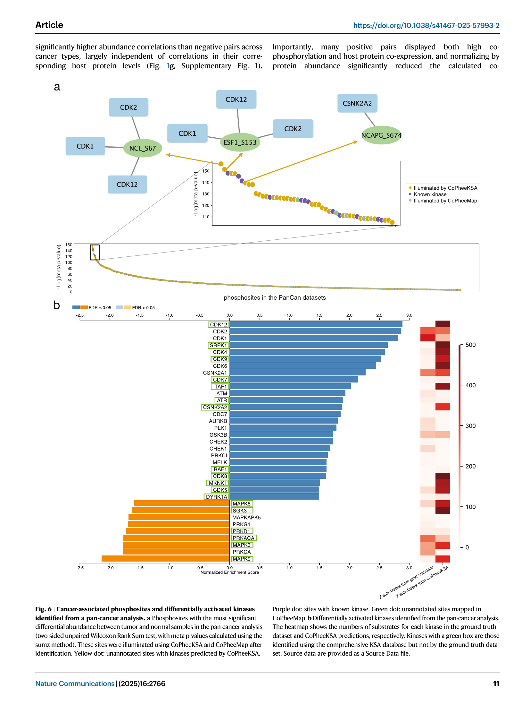

# CoPheeMap Journal Club Deep-Dive

> 📚 **저널 클럽 노트** — Jiang et al., *Nature Communications* (2025) 16:2766
> DOI: [10.1038/s41467-025-57993-2](https://doi.org/10.1038/s41467-025-57993-2)
> 1저자: Wen Jiang (Baylor College of Medicine, Bing Zhang Lab)
> 협업: Lewis C. Cantley group (Harvard) — Kinase Library 검증 협력
> Source page: [Jiang 2025 - Deciphering the Dark Cancer Phosphoproteome](../sources/jiang-2025-dark-cancer-phosphoproteome-coregulation.md)

---

## 🎯 한 줄 요약

> 💡 **Take-home**
>
> CPTAC pan-cancer phosphoproteome (11 cancer × 1,195 tumor) 를 사용해 머신러닝으로 phosphosite 간 **co-regulation network (CoPheeMap)** 을 구축하고, 이 network embedding을 feature로 활용해 **kinase–substrate association(KSA)을 예측하는 CoPheeKSA**를 개발. 결과적으로 **9,399개의 phosphosite × 104 kinase에 대해 24,015개 새 KSA**를 만들어 "dark phosphoproteome" 해석을 가능하게 함.

---

## 🧠 왜 중요한가 (Background & Motivation)

> ⚠️ **Field problem**
>
> - 인간 phosphoproteome의 **5% 미만**만 upstream kinase가 알려져 있음 (annotated)
> - **20% kinase가 90% annotated phosphosite를 보유** → 잘 연구된 kinase에 정보 편중
> - 기존 KSA 예측은 sequence motif/PSSM 중심 → understudied kinase에 일반화 어려움
> - 결과적으로 **phosphoproteomic data를 통한 kinase activity inference**의 신뢰도가 5% 영역에 갇힘 → "dark phosphoproteome" 문제

### 기존 접근의 한계

| 도구 | 방식 | 한계 |
|---|---|---|
| **NetworKIN** | sequence + PPI | substrate coverage 좁고 kinase별 모델 |
| **LinkPhinder** | bipartite missing-link | 품질이 random에 가까움 |
| **PDT (EBDT)** | kinase inhibitor 프로파일 | 비용↑, 시간↑, indirect KSA 포함 |
| **PSSM** | motif 기반 | well-studied kinase 편향 |

### CoPheeMap의 가설

> 🧩 **Working hypothesis**
>
> "함께 phosphorylate되는 site는 함께 조절될 가능성이 높다 (co-phosphorylation ⇒ co-regulation)" — transcript co-expression network와 같은 logic을 phosphosite에도 적용.

---

## 📊 데이터 (Figure 1)

> 📦 **데이터 자체가 contribution의 절반**
>
> - **CPTAC pan-cancer harmonized**: 11개 cancer type, **1,195 tumor + 688 normal**, **158,796 phosphosite** identification (그 중 77,442 quantified ≥ 20% per cohort)
> - 같은 코호트에 matched **global proteomics + RNA-Seq** → kinase activity inference 시 protein normalization 가능
> - Cancer types: BRCA, CCRCC, COAD, GBM, HCC, HNSCC, LSCC, LUAD, OV, PDAC, UCEC

### Ground truth dataset 구축 (Fig. 1c)

> 🧬 **Positive vs Negative pair 정의**
>
> - **Positive**: 같은 kinase에 의해 phosphorylate되는 site 쌍 → **192,926쌍**
> - **Negative**: 서로 다른 kinase group에 의해 phosphorylate되는 site 쌍 → **1,956,116쌍**
> - 14,679 KSA literature curation에서 추출 (362 kinase, 9,526 site)
> - **S/T–S/T pair** vs **Y–Y pair** 분리 (kinase family는 보통 둘 중 하나만)

### 세 가지 feature가 co-regulation을 잘 구분 (Fig. 1d–f)

> 📐 Positive pair는 negative pair 대비 다음 세 feature에서 모두 유의하게 높았음 (Bonferroni corrected, ****p<0.0001):
>
> 1. **Sequence similarity (BLOSUM62)** — flanking sequence 유사
> 2. **Kinase interaction profile similarity (STRING)** — host protein이 같은 PPI 상에 있음
> 3. **Co-phosphorylation correlation (PCC)** — 11개 cancer 모두에서 abundance correlation 더 높음

### 핵심 통찰 (Fig. 1g)

> 💡 **Site co-phosphorylation은 host protein co-expression과 *독립적으로* 작동**
>
> Heatmap에서 site-level correlation과 protein-level correlation을 동시 binning → site co-phosphorylation이 co-regulation을 더 강하게 예측. 즉 **단순히 protein abundance가 같이 변해서 phosphosite도 같이 변하는 게 아님**. 이게 ptmanchor 관점에서 매우 중요한 시사점.

---

## 🛠 방법: CoPheeMap 구축 (Figure 2)

> 🔧 **Architecture**
>
> 1. **Three feature streams** → XGBoost binary classifier
>    - Sequence similarity score
>    - Kinase interaction profile similarity (STRING-derived)
>    - Phosphosite correlation in 11 cancers (cancer-type별 11개 separate features)
> 2. **10× Monte Carlo CV**, FPR 0.2% threshold (negative 양 워낙 많아서 strict하게)
> 3. **3 billion candidate site pairs** scoring → **764,049 co-regulation edges** 통과 (0.03% positive rate)
> 4. **CoPheeMap = 26,280 phosphosite nodes × 764,049 edges**

### 성능 (Fig. 2b)

> 📈 **AUROC**
>
> - Combined (3 features): **0.78**
> - Static only (sequence + kinase profile): 0.75
> - Dynamic only (correlation): 0.66
> - 모든 feature가 complementary information 제공

### Network topology 검증 (Fig. 2c)

> 🌐 **Node2Vec 16-D embedding → tSNE**
>
> - Kinase **group별 clustering** (AGC, CMGC, CAMK 등) — co-regulation network가 진짜 kinase family 구조를 capture
> - 9개 kinase group, AGC 175 sites가 가장 큰 cluster
> - Scale-free network 특성: 일부 hub site (>1000 edges)
>   - 예: **RFC1_S368 (1873 edges)**, API5_S464 (1307), TOP2A_S1106 (1283)

### 추가 검증 (Fig. 2g–j)

> 🧪 **Sanity checks**
>
> - **Held-out kinase test (CSNK1A1, CSNK2A1, CSNK2A2)**: training에서 빠진 kinase의 substrates도 CoPheeMap 상에서 shorter path length로 연결됨 (KS test p=2.2e-16)
> - **Function homophily**: cell proliferation/growth annotated site들끼리 더 가까이 → 5개 functional category 모두 동일 패턴
> - **CoPheeMap site는 더 많은 cancer에서 detected** (median 3.2 cancers) → cross-cancer reproducibility ↑
> - **CoPheeMap site는 Ochoa et al. functional score가 더 높음** → 기능적으로 의미있는 site들

### 개수 통계

> 📊 **Annotated vs Unannotated**
>
> - 753,243 / 764,049 edges (98.6%)가 **최소 한쪽이 unannotated site** → 즉 network가 dark phosphoproteome으로 정보를 propagate할 수 있는 구조
> - 25,028 S/T site는 KMap (352 kinase × 3,238 edge)에 매핑

---

## 🤖 CoPheeKSA: KSA prediction (Figure 3)

> 🏗 **Architecture (CoPheeKSA)**
>
> 두 번째 XGBoost binary classifier: kinase × phosphosite 쌍이 valid KSA인지.
>
> **Input features (4 종류)**
>
> 1. **Network embedding** — Node2Vec(CoPheeMap) ⊕ Node2Vec(KMap) (16+16 = 32-dim concat)
> 2. **PSSM (motif) score** — known substrates의 consensus motif 사용
> 3. **Dynamic kinase–phosphosite correlations**:
>    - protein abundance ↔ phosphosite abundance
>    - inferred kinase activity ↔ phosphosite abundance
> 4. (각 cohort별 별도 계산 → leakage 방지: KSA 학습 시 해당 site 제외하고 activity 계산)

### 성능 (Fig. 3b)

> 📈 **CoPheeKSA AUROC = 0.95** (median across 10 MC CV)
>
> - PSSM 단독: ~0.78
> - PSSM + KMap: ~0.85
> - Full feature integration이 압도적

### Threshold & 결과 (Fig. 3c)

> ✂️ **Strict threshold (predicted prob ≥ 0.76, LLR=5.5)**
>
> 즉 244배 (e^5.5) more likely than negative.
>
> **결과: 24,015 KSA, 9,399 phosphosite, 104 S/T kinase (그 중 26개가 understudied)**.
> Ground-truth (4,873 KSA) 대비 **5배** 많은 KSA 발견.

### Kinase Library와 직교 검증 (Fig. 3d)

> 🧪 **Kinase Library (KL, Cantley lab) experimental specificity와 비교**
>
> - **Well-studied kinase**: CoPheeKSA-predicted KSA의 KL percentile score >> ground truth positive (T test p<0.0001)
> - **Understudied kinase**: ground-truth KSA의 KL percentile score는 random과 차이 없음 (p>0.01) → **literature ground truth가 understudied kinase에 대해 신뢰 어려움**
> - 즉 CoPheeKSA가 KL data를 통해 **literature curation의 한계를 우회**

### 다른 도구와 비교 (Supp. Fig. 3)

> 🆚 **vs NetworKIN, LinkPhinder, PDT**
>
> - LinkPhinder, PDT: 예측 양 많지만 KL score는 random 수준
> - NetworKIN: 품질 OK, 그러나 coverage 적음
> - **CoPheeKSA: high quality + high coverage + understudied kinase 포함**

### In-vivo specificity (Fig. 3e–f)

> 🧬 **Top-1 kinase 일치 disagreement 분석**
>
> 같은 site에서 CoPheeKSA top-1 ≠ KL top-1 인 경우 1,621 site는 CoPheeKSA의 top kinase가 host protein과의 STRING score가 더 높음 (KL의 top kinase는 577 site만). 즉 **CoPheeKSA가 in-vivo functional context에서 더 일관됨**.
>
> 이건 *KL의 in-vitro peptide binding score*가 셀룰러 컨텍스트에서 항상 일어나는 KSA를 보장하지 않는다는 뜻 — CoPheeKSA가 보완 역할.

---

## 🔍 KSA 예측 결과 분석 (Figure 4)

> 🗂 **Per-kinase KSA 분포**
>
> - **CDK8, MAPK1** 같은 well-studied kinase는 수백 개 KSA 추가
> - **CDK12, SGK3, SMG1, NUAK1** 같은 understudied kinase에 처음으로 hundreds of substrates 부여
> - 일부 kinase (CAMK2G, CDK7, DYRK1B, PAK4)는 ground-truth 자체가 random과 비슷한 KL 점수 → **literature curation이 부정확한 케이스**까지 CoPheeKSA가 교정

### 추가 IDPpub 검증

> 🔬 **PubMed abstract literature mining (IDPpub)**
>
> - CoPheeKSA 예측 60개 manual review → **56 confirmed, 4 refuted**
> - AKT3, MAP4K1 (HPK1) 등 understudied kinase에 대한 새 evidence sentence 발견
> - Ground truth KSA dataset에 빠진 KSA들이 literature에는 존재 — CoPheeKSA가 그 갭을 메움

### KSA database 통합

> 📚 **Comprehensive KSA database (deliverable)**
>
> - 100+ known substrate인 kinase는 ground truth 그대로
> - <100 known substrate인 kinase는 CoPheeKSA로 보충해서 500까지
> - 7,423 unique substrate, 다운스트림 phosphoproteomics 분석에 직접 활용 가능

---

## 🧫 Dark phosphosite 사례 연구 (Figure 5)

> 🎯 **Top 50 high-functional-score (Ochoa 2020) phosphosite 중 11개 dark site**
>
> 즉 functional importance는 예측되는데 upstream kinase 모르는 site들. CoPheeKSA로 7개에 대해 새 KSA 부여.

### 케이스 1 — **CD74 Ser22**

> - CD74: immune-stimulatory receptor (cancer overexpressed)
> - CoPheeKSA prediction: **AKT3, SGK3** as upstream
> - KL percentile score >99% for both → **immune cell activation 시 AKT3 활성과 일관**
> - 즉 CD74 phospho-regulation을 cancer immunology로 연결할 수 있는 단서

### 케이스 2 — **PRKCA Thr497** (activation loop)

> - PRKCA = PKCα, 다양한 cellular process 조절자
> - CoPheeKSA prediction: **PDK1**
> - KL top kinase도 PDK1 → 일치
> - 문헌상 PDK1이 PRKCA T497 phosphorylate해서 secondary autophosphorylation 유도 → **CoPheeKSA가 known mechanism을 정확히 recover**

### 케이스 3 — **HSP90AB1 Ser226**

> - HSP90AB1: chaperone
> - CoPheeKSA: **CK2A1 (CSNK2A1)** prediction
> - KL도 top → 일치

### 케이스 4 — **VIM Ser25** (CoPheeKSA에서 confident prediction은 못 했음)

> - VIM: type III intermediate filament
> - 그러나 CoPheeMap network 상 PRKACA, PRKCA, PRKD1 substrate들과 인접
> - **AGC family 11개 kinase가 KL top-25에 들어감** → network neighborhood inference로 후보 kinase family 좁히기 가능

> 💡 **Take-home from Fig 5**
>
> CoPheeMap + CoPheeKSA는 두 단계 정보를 제공:
> 1. (확신할 때) direct KSA 예측
> 2. (확신 어려울 때) network neighbors 통한 indirect kinase family 후보 좁히기

---

## 🦠 Cancer-associated phosphosite & differentially active kinase (Figure 6)

> 🧪 **Tumor vs NAT differential phospho 분석**
>
> 8개 CPTAC cohort (tumor + matched NAT)에서 phosphosite differential analysis → cross-cohort meta-p로 pan-cancer differentially-regulated site 추출.

### 핵심 결과

> 📌 **CoPheeKSA-augmented kinase activity inference**가 기존 방법(PSSM/NetworKIN)이 놓친 다음을 발견:
>
> - Understudied kinase의 cancer-associated activation pattern
> - Tumor type-specific kinase signature (CCRCC vs HNSCC vs UCEC 등)
> - 기존 substrate set으로는 추적 못 하던 dark site의 dysregulation

> 🎯 **Therapeutic target hypothesis**
>
> Understudied kinase 중 다수 cancer cohort에서 hyperactive signature → 새 therapeutic target 후보 (논문에선 일부 cohort-specific 예시 제시).

---

## ⚠️ Limitations & 비판점

> 🚧 **저널 클럽 토론 포인트**
>
> 1. **CPTAC 11개 cancer 한정** → blood cancer, pediatric cancer 미커버
> 2. **S/T kinase에만 적용** (Y-Y network는 별도 — Y kinase는 적은 site로 제한적)
> 3. **Co-phosphorylation ≠ direct co-regulation**: 같은 kinase가 아니어도 같은 pathway downstream이면 correlate 가능 → false positive 일부 존재 가능
> 4. **XGBoost prediction에서 protein abundance confounding 명시적으로 분리 안 됨** → ptmanchor 같은 site-level protein-aware correction 적용 시 추가 변화 가능
> 5. **Kinase Library validation은 in-vitro peptide binding** → CoPheeKSA prediction이 KL과 일치 안 하는 경우, 어느 쪽이 진실인지 cell-line 실험 필요
> 6. **ground-truth KSA에 mouse data가 일부 섞일 수 있음** (literature curation specificity 한계)
> 7. **understudied kinase는 결국 ground truth 자체가 적어서** validation도 약함 — confirmation bias 위험

---

## Connections

- [ptmanchor Manuscript Anchor](./ptmanchor-manuscript-anchor.md)
- [PTM Correction and Kinase Signaling in Cancer Proteomics](../topics/ptm-correction-and-kinase-signaling-in-cancer-proteomics.md)
- [Source: Jiang 2025 — Dark Cancer Phosphoproteome](../sources/jiang-2025-dark-cancer-phosphoproteome-coregulation.md)
- [Source: Muller-Dott 2025 — Phosphoproteomic Kinase Activity Inference](../sources/muller-dott-2025-phosphoproteomic-kinase-activity-inference.md)
- [Source: Shi 2025 — Functional Network of Human Cancer Proteogenomics](../sources/shi-2025-functional-network-human-cancer-proteogenomics.md)

---

## ptmanchor 원고와의 연결점

> 🧬 **Why this paper matters for ptmanchor**
>
> - CoPheeMap/CoPheeKSA는 **downstream interpretation**에 강점
> - ptmanchor는 **upstream signal correction (site-level protein anchoring)**에 강점
> - **둘은 상호보완적**: ptmanchor로 corrected phosphosite signal을 CoPheeKSA에 input → kinase activity inference의 robustness 더 향상 가능
> - ptmanchor manuscript discussion에서 "downstream interpretation pipeline (e.g. CoPheeKSA)와 결합 시 미해결된 dark phosphoproteome 영역까지 보강"이라는 future direction 추가 가능

> 💡 **반박 포인트도 있음**
>
> CoPheeMap의 "site correlation" feature가 protein-level confounding을 일부 흡수했을 수 있음 — ptmanchor 관점에선 **protein-corrected site correlation을 input으로 다시 학습**하면 KSA prediction의 false positive 비율이 어떻게 변하는지 보는 follow-up 실험이 가치 있음.

---

## 발표 시 강조할 핵심 메시지

> 🎤 **Slide deck 제안 흐름**
>
> 1. **Problem**: Dark phosphoproteome — 95%의 site에 kinase 미상
> 2. **Insight**: Co-phosphorylation은 co-regulation의 강력한 indicator
> 3. **Method 1 — CoPheeMap**: XGBoost로 site–site network 구축 (3 billion → 764K edges)
> 4. **Method 2 — CoPheeKSA**: Node2Vec embedding + dynamic feature → kinase–site prediction (AUROC 0.95)
> 5. **Result**: 24,015 KSA, 26 understudied kinase에 substrate 부여
> 6. **Validation**: Kinase Library (in vitro), STRING (in vivo functional context), IDPpub (literature)
> 7. **Application**: Dark site의 upstream kinase 추정, cancer-specific kinase signature
> 8. **Outlook**: CoPheeMap이 새 phosphoproteomic data 해석의 reusable resource로 자리잡음

---

## 토론 질문 (저널 클럽)

> 🤔 **Q1.** Site correlation feature가 protein abundance correlation을 그대로 반영하지 않도록 어떻게 control했는가? (Methods에서 site abundance를 직접 사용했음 → protein normalization은 안 됨)
>
> 🤔 **Q2.** Understudied kinase의 ground truth가 random과 비슷한데, CoPheeKSA가 그 ground truth로 학습됐다면 prediction quality도 random에 가까워지는 게 아닌가? → 저자는 KL과 STRING으로 cross-validation 했지만, 그 자체로 충분한가?
>
> 🤔 **Q3.** CoPheeMap edge의 phosphorylation correlation이 cancer-type별로 다른 의미를 가질 수 있나? Pan-cancer averaged feature가 일부 cancer-specific KSA를 놓치는가?
>
> 🤔 **Q4.** Y-Y phosphosite (Tyrosine kinase)는 별도 처리되었는데, 이 부분은 데이터 부족으로 짧게 다룸. 향후 ImmunoTherapy-relevant Y kinase (예: BTK, JAK 등) 적용 어떻게 확장할 수 있나?
>
> 🤔 **Q5.** CoPheeKSA의 in-vivo specificity가 KL보다 높다고 주장 — 이를 정말 입증하려면 어떤 wet-lab 실험이 추가로 필요한가?

---

## Sources

- Local PDF: `raw/inbox/papers/jiang-2025-dark-cancer-phosphoproteome-coregulation.pdf`
- Article: <https://www.nature.com/articles/s41467-025-57993-2>
- Source page: [Jiang 2025 - Deciphering the Dark Cancer Phosphoproteome](../sources/jiang-2025-dark-cancer-phosphoproteome-coregulation.md)
- GitHub: <https://github.com/bzhanglab/CoPheeMap>
- Figure assets: `raw/assets/copheemap/`
