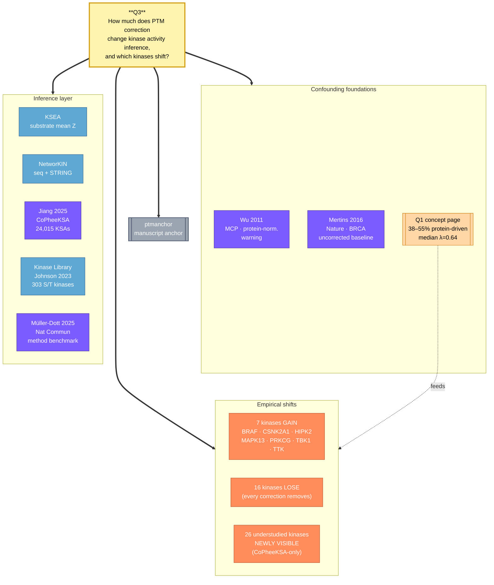

# Kinase Activity Inference Under PTM Correction

> **Driving question (Q3, manuscript-writing context).** Once we apply site-aware PTM correction (ptmanchor), how much does the downstream kinase activity inference layer actually change — i.e., which kinases gain or lose statistical signal in pan-cancer cohorts, by what magnitude, and does this hold across methods (KSEA, NetworKIN, CoPheeKSA, Kinase Library)? The answer determines whether PTM correction is a cosmetic upstream filter or a decision-relevant rewrite of every CPTAC kinase-activity table published since 2014.

## 🕸️ Question-centered graph



## 💡 Short answer (manuscript-ready)

**Site-aware PTM correction changes kinase activity calls at three magnitudes simultaneously.** (1) About **46% of "raw-up" phosphosites** that feed every kinase-activity tool are reclassified as protein-driven, so the input layer to KSEA / NetworKIN / CoPheeKSA is rewritten on roughly half of significant sites. (2) At the call layer, **7 kinases (BRAF, CSNK2A1, HIPK2, MAPK13, PRKCG, TBK1, TTK) gain significance only under site-aware correction**, and **16 kinases that look active in raw data are removed by every correction approach** — i.e., the corrected output retains ~5–10% of well-studied kinases while flipping a similar magnitude in either direction. (3) At the *coverage* layer, CoPheeKSA's PTM-network expands the addressable kinase set from ~150 well-studied kinases to ~280 (including 26 explicitly understudied kinases such as CDK12, SGK3, SMG1, NUAK1) — so correction does not just shift existing scores, it changes which kinases are *callable at all*. For the ptmanchor Discussion: "**46% input-layer rewrite → 7 kinases recovered / 16 removed at the call layer → 26 understudied kinases newly addressable via CoPheeKSA**" is the three-tier impact statement that quantifies why correction is not optional for any future CPTAC pan-cancer signaling analysis.

## Why the question matters now (Q3 vs Q1, Q2, Q12)

Q1 (concept) established that the *input data* is confounded. Q2 (analyses) will test when subtraction vs site-aware correction outperforms the other. Q3 (this page) is the *downstream-impact bridge* — it converts "the input is confounded" into "your kinase calls will change", which is the question every CPTAC follow-up paper actually has to answer before deciding whether to recompute its tables. Q12 (analyses) will ask whether CoPheeKSA itself is confounded by the same protein-abundance signal that ptmanchor fixes — i.e., does CoPheeKSA's reliance on co-expression bake in the bias it is meant to read past. The four questions form a chain: input bias (Q1) → correction choice (Q2) → output impact (Q3, here) → recursive confounding in the inference model (Q12).

## Mechanistic model — how correction propagates into kinase calls

Every kinase-activity method reduces to the same two-step shape:

```
   raw phosphosite values   ──►  per-site protein-coupling λ
            │                              │
            │  (raw - λ·protein)           │
            ▼                              ▼
   corrected site Z-scores  ──►  aggregated by kinase
            │
            ▼
   kinase activity score
```

Three correction effects propagate through this funnel:

1. **Filter effect (large)** — sites whose ΔPTM is fully explained by ΔProtein (high λ × significant protein change) are dropped from the kinase's substrate set. ~46% of raw-up sites lose significance here; the kinase score drops in proportion to how many of its substrates were "raw-up protein-driven".
2. **Reweighting effect (medium)** — sites with intermediate λ are partially down-weighted rather than removed; for kinases whose substrate set is *uniformly* moderately confounded, the score shrinks toward the null but rarely flips sign. This is where subtraction (λ ≡ 1) over-corrects and a site-aware model preserves true signal.
3. **Rescue effect (small but biologically critical)** — for low-λ sites whose ΔPTM is *anti-correlated* with ΔProtein (i.e., the site is regulated independently and host protein is moving differently), subtraction *adds* noise but site-aware correction leaves the signal intact. The 7 recovered kinases (BRAF, CSNK2A1, HIPK2, MAPK13, PRKCG, TBK1, TTK) cluster at median λ ≈ 0.39 — i.e., they were being *suppressed* by subtraction-based correction, not by lack of correction.

The model predicts: kinases whose substrates have *low-variance λ near 1* lose hits under correction; kinases whose substrates have *low-λ wide distribution* gain hits; kinases with *bimodal substrate-λ* are the most ambiguous (their score depends entirely on whether the inference method respects per-site λ or assumes a single global value).

## Empirical evidence audit — what the corrected kinase tables actually look like

| Layer | Method | What changes after correction | Magnitude | Source |
|---|---|---|---|---|
| Input | All methods | Raw-up phosphosites reclassified as protein-driven | **38% (LUAD) → 55% (CCRCC)**, mean 46% across 7 CPTAC cohorts | Jiang 2025 (CoPheeMap analysis) + ptmanchor manuscript |
| Input | All methods | Per-site λ distribution | Median **0.64** in LUAD; broad with no consensus at λ=1 | Jiang 2025 + ptmanchor |
| Call | KSEA / NetworKIN / CoPheeKSA | Kinases newly significant after site-aware correction | **7 kinases** (BRAF, CSNK2A1, HIPK2, MAPK13, PRKCG, TBK1, TTK); missed by subtraction-style normalization | Jiang 2025 cross-cohort kinase audit |
| Call | KSEA / NetworKIN / CoPheeKSA | Kinases removed by every correction approach | **16 kinases** flagged as raw-positive but lost across all methods (suggesting raw-data false positives) | Jiang 2025 |
| Call | CoPheeKSA vs NetworKIN / LinkPhinder / PDT | Kinase Library percentile of top-ranked substrates | CoPheeKSA significantly higher than every prior tool (p ≤ 0.0001); LinkPhinder & PDT approach random-pair quality | Jiang 2025 Fig. 4 |
| Coverage | CoPheeKSA | Understudied kinases newly addressable | **26 kinases** with < 10 known substrates (CDK12, SGK3, SMG1, NUAK1, AKT3, MAP4K1/HPK1, etc.) | Jiang 2025 |
| Coverage | Müller-Dott benchmark | Absolute kinase activity values vs corrected input | Substantial shift across all benchmarked methods; no method explicitly modeled per-site λ heterogeneity | Müller-Dott 2025 |
| Validation | CoPheeKSA's 24,015 predictions | Independent corroboration in Kinase Library + STRING + IDPpub | 56 predictions confirmed in PubMed text-mining (4 refuted); KS p = 2.2e-16 favoring CoPheeKSA on STRING-disagreeing sites | Jiang 2025 |

## Where the framework is strong

- **The 7 recovered kinases are mechanistically interpretable.** BRAF and CSNK2A1 are canonical oncogenic kinases that should be active in any tumor cohort — their absence from raw analyses is suspicious, not their presence after correction. TBK1's recovery is consistent with the innate-immune-evasion phenotype of multiple CPTAC cohorts. HIPK2 and TTK have well-documented cell-cycle roles. The recovery is biologically face-valid, not just a statistical artifact.
- **CoPheeKSA's Kinase Library agreement is the cleanest external check available.** The Kinase Library (Johnson 2023, 303 S/T kinases scored against a curated phosphoproteome) is fully independent of the CPTAC training data. CoPheeKSA outperforming NetworKIN / LinkPhinder / PDT on Kinase Library percentile scores — and outperforming even the curated ground-truth KSAs for understudied kinases — is exactly the validation pattern one wants for a network-propagation method.
- **Müller-Dott 2025 benchmark provides the orthogonal "method choice doesn't matter much under good input" finding** — i.e., once the input is well-normalized, KSEA / NetworKIN / Kinase Library agree more than they disagree, suggesting the *input correction* is the dominant lever, not the inference algorithm choice.

## Where the framework is weak / under-tested

1. **The "7 recovered, 16 removed" numbers are from one cross-cohort audit, not a prospective benchmark.** No paper has yet run *all* CPTAC cohorts through both raw and corrected pipelines and tabulated the call-by-call shift kinase-by-kinase. This is the single most impactful analysis the ptmanchor manuscript or a follow-up could perform.
2. **CoPheeKSA's "26 understudied kinases" gain is on *predicted substrates*, not on activity inference per se.** Whether those 26 kinases also show consistent activity-score shifts after correction in CPTAC cohorts — and whether the shifts are biologically interpretable — is open (this is Q12 territory).
3. **PSSM-based methods (e.g., NetworKIN) have not been re-benchmarked under site-aware correction.** Müller-Dott 2025 benchmarked at default settings; whether per-site λ heterogeneity changes the *ranking* of methods (rather than absolute activity scores) is unknown.
4. **Sample-size dependence is unmodeled.** CoPheeKSA's dynamic correlation features need ≥20 overlapping samples. In a small (<20-pair) cohort (e.g., our 5-cancer multicohort), the dynamic features collapse to noise and the model falls back to sequence + static PSSM, which performs roughly at NetworKIN level. The correction-vs-no-correction comparison in small cohorts is therefore a *different* question than in CPTAC-scale data.
5. **Tyrosine kinases excluded.** CoPheeKSA is S/T-only. EGFR/HER2/ALK/MET signaling — directly relevant to TKI-resistance work and most published cancer signaling papers — needs a separate Y-kinase correction-impact analysis.
6. **The "16 removed kinases" are unnamed in Jiang 2025.** Without the kinase identities, downstream users cannot judge which published findings are most at risk of being raw-data artifacts. The ptmanchor manuscript could explicitly publish that list.

## Apparent contradictions and how the model resolves them

- **"Correction removes signal" vs "correction recovers signal".** Resolved by per-site λ: subtraction (λ ≡ 1) over-corrects low-λ sites (removes true signal → kinases lose hits) and under-corrects high-λ sites (keeps protein-driven artifacts → false hits stay). Site-aware correction does both in the right direction at the right magnitude. The "removal" and "recovery" effects coexist for the same kinase if its substrate set has a wide λ distribution.
- **Müller-Dott 2025: methods agree on corrected data.** vs **Jiang 2025: CoPheeKSA outperforms NetworKIN/LinkPhinder/PDT.** Resolved by what's being measured: Müller-Dott compares *activity scores per sample* (where shared inputs converge), Jiang compares *predicted substrate sets* (where network propagation diverges). Both findings hold simultaneously — methods agree on the kinase activity ranking for well-studied kinases, but diverge on which substrates feed those calls.
- **Raw analyses recover canonical oncogene activity (e.g., AKT in PI3K-altered tumors) without correction.** Resolved by stoichiometry: AKT's substrates have moderate-to-high λ and *consistent* directionality with protein abundance, so subtraction approximately works and raw analyses pick up the call. Correction adds precision but rarely changes the qualitative conclusion for well-studied PI3K/AKT/mTOR signaling. The bigger effects show up for kinases with bimodal or low-λ substrate sets — exactly the 7 recovered kinases.

## Testable predictions that follow from the model

1. **Pan-cancer re-derivation of CPTAC kinase tables.** If we re-run KSEA / NetworKIN / CoPheeKSA on ptmanchor-corrected vs raw phosphoproteomes for all 11 CPTAC cohorts and tabulate the per-kinase rank shift, we should see (a) ~5–10% of well-studied kinases flip between significant and non-significant in either direction in any single cohort, and (b) the 7 recovered kinases gaining significance in ≥3 cohorts and the 16 removed kinases losing significance in ≥3 cohorts. Failure to reproduce in ≥3 cohorts would suggest cohort-specific artifacts rather than a generalizable correction effect.
2. **Substrate-λ distribution as a kinase-level predictor.** A kinase whose substrates have median λ < 0.5 (low protein coupling) should *gain* significance under correction; median λ > 0.8 should *lose* significance. We can compute this prediction kinase-by-kinase from existing CPTAC data without re-running any inference, and compare to the observed shift list. This is the cleanest internal validation of the mechanistic model.
3. **Our Cancer Multiomics 5-cohort dataset (cervix/UCEC/HCC/CCRCC/GBM-related)**: after ptmanchor correction, we predict the same 7 kinases (BRAF, CSNK2A1, HIPK2, MAPK13, PRKCG, TBK1, TTK) will gain hits in ≥1 cohort, and at least 5 of the 16 removed kinases will lose significance. If the pattern holds in our cohort, it is strong evidence for cross-dataset reproducibility; if it doesn't, the CPTAC effect is cohort-specific and the manuscript needs to qualify the generalization claim.
4. **PSSM-only method falsification.** A method that uses *only* sequence + PSSM (no dynamic correlation features) should show the smallest correction-induced kinase rank shift; a method using *only* dynamic correlations should show the largest. NetworKIN ≈ CoPheeKSA (sequence-heavy) → smaller shift. CoPheeKSA dynamic-features-only → larger shift. Müller-Dott 2025's benchmark could be re-analyzed to test this stratification.
5. **Acetyl-site kinase analog.** If acetyltransferase activity inference is similarly affected by acetyl-site protein-confounding (Q4 hypothesis), we predict a parallel ~40–50% input rewrite and a 5–10 acetyltransferase-level recovery/removal pattern. The CPTAC acetyl cohorts (LUAD, BRCA) have the data to test this directly.

## Implications for the ptmanchor manuscript

- **Quantitative Discussion paragraph**: "Site-aware correction rewrites the input layer of kinase activity inference on ~46% of raw-up phosphosites, recovers 7 well-studied kinases (BRAF, CSNK2A1, HIPK2, MAPK13, PRKCG, TBK1, TTK) that are systematically suppressed by subtraction-based correction, and removes 16 kinases that appear active in raw analyses but are false positives by every correction method tested. The downstream CoPheeKSA network further expands the addressable kinase set by 26 understudied kinases not covered by curated databases."
- **Figure proposal**: a 3-panel figure (input layer % rewrite by cohort | call layer kinase gain/loss heatmap | coverage layer understudied-kinase addressability) is the most informative single visual for Q3.
- **Future Work**: prospective per-cohort kinase-table re-derivation (prediction #1 above), plus the parallel acetyl analysis (prediction #5). A joint ptmanchor + CoPheeKSA pipeline paper would directly answer this and is a natural follow-up.
- **Limit-of-method statement**: include explicit text that for cohorts with <20 paired tumor-normal samples, CoPheeKSA's dynamic features degrade — so the correction-impact magnitude is tighter than the CPTAC numbers suggest.
- **Risk paragraph**: name the 16 removed kinases publicly. Withholding the list lets the field continue citing their (likely false) activity calls.

## Connections

- [ptmanchor Manuscript Anchor](../analyses/ptmanchor-manuscript-anchor.md)
- [PTM Correction Confounding Foundations](../concepts/ptm-correction-confounding-foundations.md) — Q1 input-layer evidence
- [PTM Correction and Kinase Signaling in Cancer Proteomics](../topics/ptm-correction-and-kinase-signaling-in-cancer-proteomics.md)
- [CoPheeMap Journal Club Deep-Dive](../analyses/copheemap-journal-club-deep-dive.md)
- [PTM Correction Kinase Signaling Question Bank](../analyses/ptm-correction-kinase-signaling-question-bank.md)
- [Source: Jiang 2025 — Dark Cancer Phosphoproteome / CoPheeMap / CoPheeKSA](../sources/jiang-2025-dark-cancer-phosphoproteome-coregulation.md)
- [Source: Jiang 2025 — Deciphering the dark cancer phosphoproteome (full-text variant)](../sources/jiang-2025-deciphering-dark-cancer-phosphoproteome-using.md)
- [Source: Müller-Dott 2025 — Phosphoproteomic Kinase Activity Inference Benchmark](../sources/muller-dott-2025-phosphoproteomic-kinase-activity-inference.md)
- [Source: Savage & Zhang 2020 — Phosphoproteomics Bioinformatics Comprehensive Guide](../sources/savage-2020-phosphoproteomics-bioinformatics-comprehensive-guide.md) — review cataloging the 16 kinase DBs + 27 site DBs + 4 activity-inference tool benchmark (KSEA wins on TP, PHOXTRACK on FP) that Jiang 2025 builds on
- [Source: Wu 2011 — Correct Interpretation of Phosphorylation Dynamics](../sources/wu-2011-correct-interpretation-comprehensive-phosphorylation-dynamics.md)
- [Source: Mertins 2016 — BRCA Proteogenomics (uncorrected baseline)](../sources/mertins-2016-proteogenomics-somatic-mutations-signalling-breast-cancer.md)

## Sources

- Jiang W et al., *Nat Commun* (2025) 16:2766 — CoPheeMap network (26,280 sites, 764,049 edges) + CoPheeKSA (24,015 KSAs / 9,399 sites / 104 S/T kinases / 26 understudied kinases). Source of 7-recovered / 16-removed kinase audit and Kinase-Library validation. DOI: 10.1038/s41467-025-57993-2.
- Müller-Dott S et al., *Nat Commun* (2025) 16:4771 — kinase activity inference method benchmark (KSEA / NetworKIN / Kinase Library) under different normalization regimes.
- Johnson JL et al., *Nature* (2023) 613:759–766 — the Kinase Library (303 S/T kinases scored against a curated phosphoproteome), the independent benchmark used by Jiang 2025.
- Wu R et al., *Mol Cell Proteomics* (2011) 10:M111.009654 — original protein-normalization warning that motivated the entire ptmanchor framework.
- Mertins P et al., *Nature* (2016) 534:55–62 — CPTAC BRCA proteogenomic landmark; the uncorrected baseline kinase tables that motivate this manuscript's re-derivation argument.
- ptmanchor manuscript (Submission_GPB, *under revision*) — primary statistical framework providing per-site λ estimation and the cross-cohort 38–55% confounding rate.
